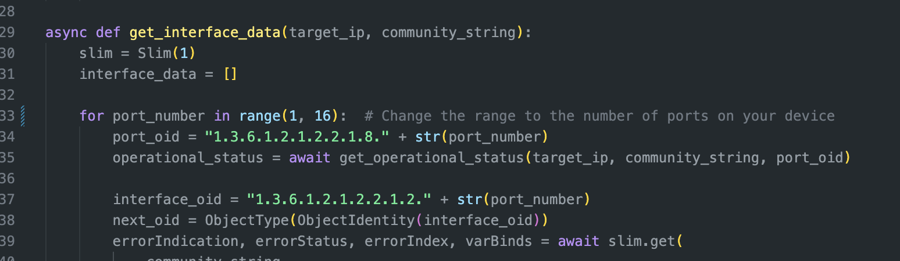
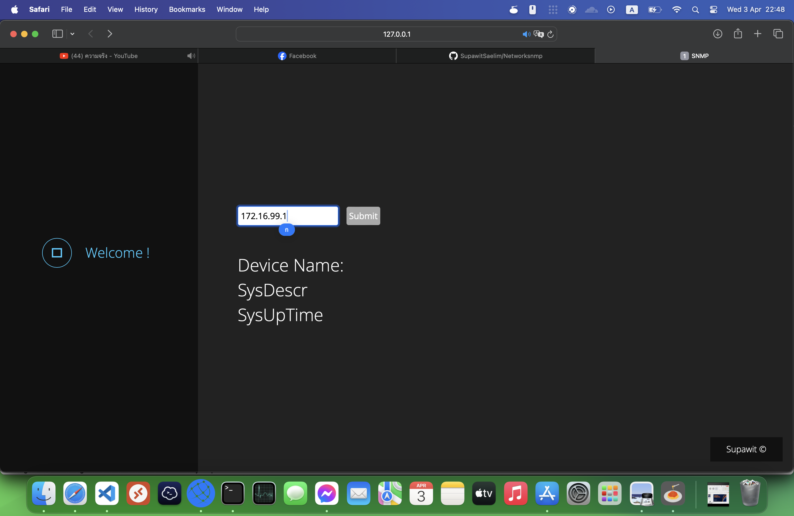
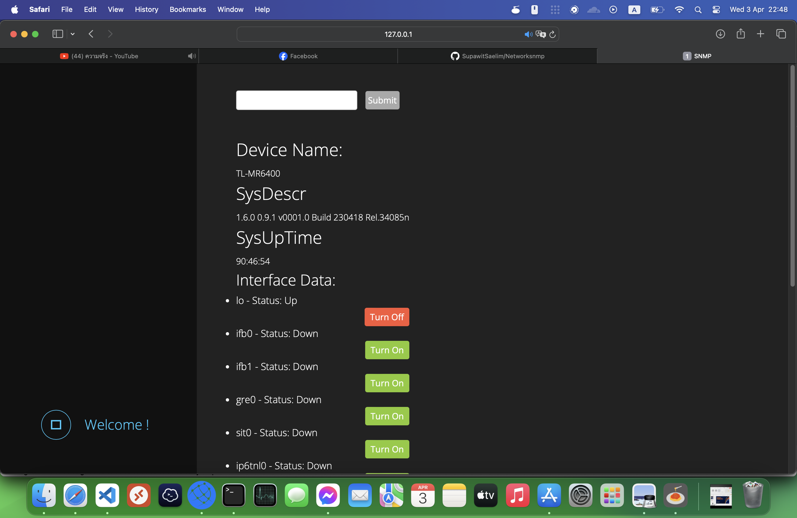
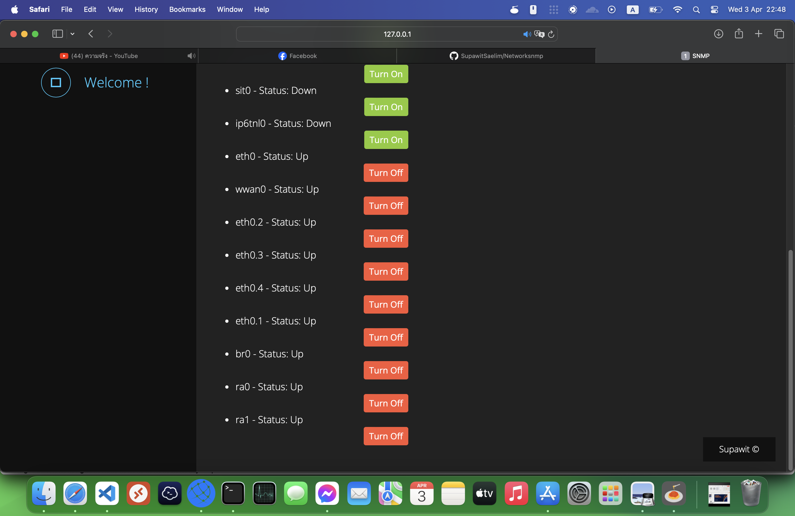

# Network Monitoring and Control System

This Python application utilizes Flask and asyncio to create a simple network monitoring and control system using SNMP (Simple Network Management Protocol). The system allows you to monitor the status of network interfaces and control their operational status remotely.

## Features

- **SNMP Data Retrieval**: Fetches system uptime, description, and name using SNMPv2-MIB.
- **Interface Data Retrieval**: Retrieves operational status and interface names for network interfaces.
- **Port Control**: Allows turning network ports on or off remotely.

## Requirements

- Python 3.x
- Flask
- pysnmp

## Usage

1. Install the required packages using `pip install flask pysnmp`.
2. Modify the target IP address and community string in the code as needed.
3. Run the application using `python app.py`.
4. Access the application via a web browser at `http://localhost:5000`.
5. Enter the target IP address and submit to retrieve SNMP data and interface status.
6. Control individual ports by selecting the desired action from the dropdown menu and clicking "Submit".

## Note

- This application assumes SNMP access to the target device with the specified community string.
- Ensure that the target device is configured to allow SNMP access and the appropriate permissions are set.
- Exercise caution while controlling ports remotely, as it may disrupt network connectivity.

Feel free to contribute to this project and extend its functionality further!

